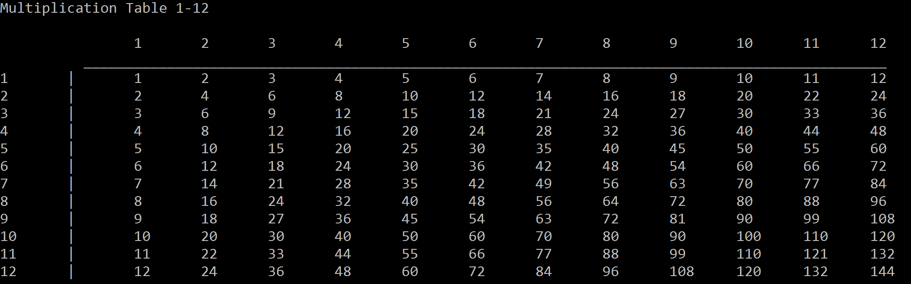

# C# Code Challenges
## Coding challenges in C#

Completing challenges (or variations of challenges) from: https://adriann.github.io/programming_problems.html

1. [Write a program that prints 'Hello World' to the screen.](/MultiplyOrAdd/Program.cs)
2. [Write a program that asks the user for their name and greets them with their name.](/MultiplyOrAdd/Program.cs)
3. [Modify the previous program such that only the users Alice and Bob are greeted.](/MultiplyOrAdd/Program.cs)
4. [Write a program that asks the user for a number n and prints the sum of the numbers from 1 to n.](/MultiplyOrAdd/Program.cs)
5. [Modify the previous program such that only multiples of three are five are considered in the sum.](/MultiplyOrAdd/Program.cs)
6. [Write a program that asks the user for a number n and gives them the possibility to choose between computing the sum and computing the product of 1, ..., n.](/MultiplyOrAdd/Program.cs)
7. [Write a program that prints a multiplication table for numbers up to 12 and is formatted correctly.](/MultiplicationTable/Program.cs)

8. [Write a program that prints all prime numbers up to 100.](/PrimeNumbers/Program.cs)
9. [Write a function that returns the largest element in a list without using .Max().](/ListChallenges/Program.cs)
10. [Write a function that reverses a list without using .Reverse().](/ListChallenges/Program.cs)
11. [Write a function that checks if an element occurs within a list without using .Contain().](/ListChallenges/Program.cs)
12. [Write a function that returns only the elements at odd indexes in a list.](/ListChallenges/Program.cs)
13. [Write a function that keeps a running total of a list.](/ListChallenges/Program.cs)
14. [Write a function that checks if a string is a palindrome.](/ListChallenges/Program.cs)

